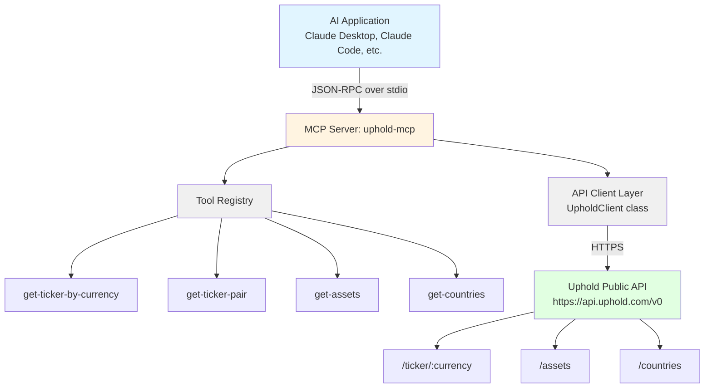
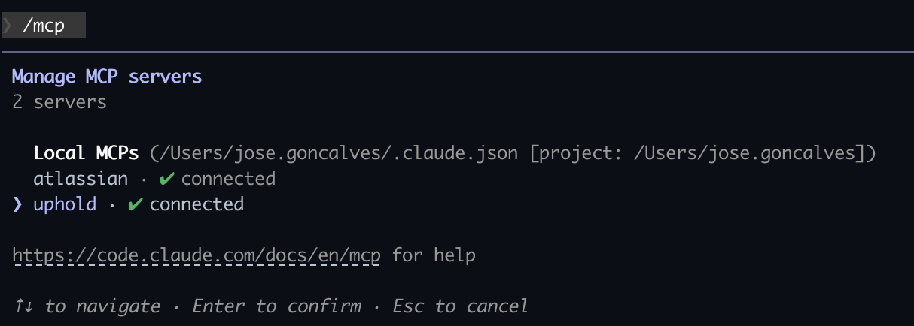
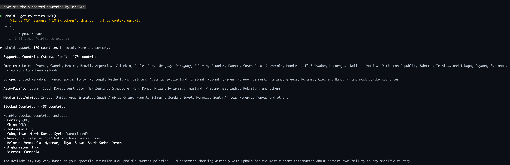

# Uphold MCP Server

A [Model Context Protocol (MCP)](https://modelcontextprotocol.io/) server that exposes [Uphold's](https://uphold.com/) public cryptocurrency APIs as tools for AI assistants like Claude.

This server provides real-time access to exchange rates, supported assets, and country information without requiring authentication.

## What is MCP?

The Model Context Protocol (MCP) is an open standard that enables AI assistants to securely interact with external data sources and tools. It provides a standardized way for AI models to:

- Access real-time data from APIs
- Execute tools and functions
- Maintain context across conversations

### Architecture Diagram



## Project Structure

```
uphold-mcp-server/
├── src/
│   ├── server.ts           # Entry point with StdioServerTransport
│   ├── client.ts           # Uphold API client class
│   ├── types.ts            # TypeScript types and error classes
│   ├── utils/
│   │   ├── logger.ts       # Pino logger configuration
│   │   └── http-client.ts  # HTTP request utility
│   └── tools/
│       ├── index.ts        # Tool registry
│       ├── tickers.ts      # Ticker tools (2 tools)
│       ├── assets.ts       # Assets tool
│       └── countries.ts    # Countries tool
├── test/                   # Vitest test files
│   ├── client.test.ts
│   ├── types.test.ts
│   ├── utils/
│   │   ├── http-client.test.ts
│   │   └── logger.test.ts
│   └── tools/
│       ├── index.test.ts
│       ├── tickers.test.ts
│       ├── assets.test.ts
│       └── countries.test.ts
├── package.json            # Dependencies & npm scripts
├── tsconfig.json           # TypeScript config
├── vitest.config.ts        # Vitest configuration
└── README.md               # This file
```

## Installation

### Prerequisites

- Node.js 24.12.0 or higher
- npm or yarn

### Setup

```bash
# Clone or download the project
cd uphold-mcp-server

# Install dependencies
npm install

# Build the TypeScript code
npm run build

# Run tests
npm test
```

## Available Tools

| Tool Name | Description | Parameters |
|-----------|-------------|------------|
| `get-ticker-by-currency` | Get exchange rates for a specific currency against all others | `currency`: Currency code (e.g., 'BTC', 'USD') |
| `get-ticker-pair` | Get the exchange rate for a specific currency pair | `pair`: Currency pair (e.g., 'BTCUSD') |
| `get-assets` | Get all supported cryptocurrencies and fiat currencies | None |
| `get-countries` | Get all countries where Uphold is available | None |

### Tool Examples

#### get-ticker-by-currency
Get all pairs for Bitcoin:
```
Input: { "currency": "BTC" }
```
Returns all BTC trading pairs.

#### get-ticker-pair
Get specific pair rate:
```
Input: { "pair": "ETHUSD" }
```
Returns:
```json
{
  "ask": "2650.00",
  "bid": "2645.00",
  "currency": "USD",
  "pair": "ETHUSD"
}
```

#### get-assets
Returns all supported assets:
```json
[
  {
    "code": "BTC",
    "name": "Bitcoin",
    "status": "open",
    "type": "cryptocurrency"
  },
  {
    "code": "USD",
    "name": "US Dollar",
    "status": "open",
    "type": "fiat"
  },
  ...
]
```

#### get-countries
Returns supported countries:
```json
[
  {
    "code": "US",
    "name": "United States",
    "currency": "USD"
  },
  ...
]
```

## Environment Variables

The server requires the following environment variables:

| Variable | Required | Default | Description |
|----------|----------|---------|-------------|
| `UPHOLD_API_BASE_URL` | Yes | - | Base URL for the Uphold API (e.g., `https://api.uphold.com/v0`) |
| `LOG_LEVEL` | No | `info` | Logging level (`debug`, `info`, `warn`, `error`) |

### Example `.env` file

```bash
UPHOLD_API_BASE_URL=https://api.uphold.com/v0
LOG_LEVEL=info
```

> **Note:** The server will throw an error on startup if `UPHOLD_API_BASE_URL` is not set.

## Configuration

Edit `~/.claude.json` in desired `project`:

```json
{
  "mcpServers": {

    "uphold": {
      "command": "node",
      "args": [
        "/Users/jose.goncalves/Repos/uphold-mcp-server/dist/server.js"
      ],
      "env": {
        "UPHOLD_API_BASE_URL": "https://api.uphold.com/v0"
      }
    }
  }
}
```

#### Verify installation

After configuration, you can verify the server is loaded:

```bash
# List configured MCP servers
claude mcp list
```





## Development

### Running locally

```bash
# Set required environment variable
export UPHOLD_API_BASE_URL=https://api.uphold.com/v0

# Run in development mode with hot reload
npm run dev

# Build for production
npm run build

# Run production build
npm start
```

### Testing

The project uses [Vitest](https://vitest.dev/) for testing with comprehensive test coverage.

**Test setup:** Tests use the environment variable defined in `test/setup.ts`. Make sure `UPHOLD_API_BASE_URL` is set before running tests.

```bash
# Run tests once
npm test

# Run tests in watch mode
npm run test:watch

# Run tests with UI
npm run test:ui

# Run tests with coverage report
npm run test:coverage
```

### Testing tools manually

You can test the server using the MCP Inspector or by sending JSON-RPC messages:

```bash
# Using MCP Inspector (if installed)
npx @modelcontextprotocol/inspector node dist/server.js
```

### Project Scripts

| Script | Description |
|--------|-------------|
| `npm run build` | Compile TypeScript to JavaScript |
| `npm run start` | Run the compiled server |
| `npm run dev` | Run in development mode with tsx |
| `npm test` | Run tests once |
| `npm run test:watch` | Run tests in watch mode |
| `npm run test:ui` | Run tests with Vitest UI |
| `npm run test:coverage` | Run tests with coverage report |

### Logging

The server uses [Pino](https://getpino.io/) for structured logging with pretty-printing in development. Logs are sent to stderr to avoid interfering with the MCP protocol on stdout.

You can control the log level with the `LOG_LEVEL` environment variable:

```bash
LOG_LEVEL=debug npm run dev
```

## API Reference

This server uses Uphold's public API endpoints:

| Endpoint | Description |
|----------|-------------|
| `GET /v0/ticker/:currency` | Rates for a specific currency (also supports pair format like `BTCUSD`) |
| `GET /v0/assets` | All supported assets |
| `GET /v0/countries` | All supported countries |

For more details, see the [Uphold API Documentation](https://docs.uphold.com/).

## Troubleshooting

### Server not appearing in Claude

1. **Check the path**: Ensure the path in your configuration is absolute and correct
2. **Verify build**: Make sure you've run `npm run build` and the `dist/` folder exists
3. **Check environment variables**: Ensure `UPHOLD_API_BASE_URL` is set in your configuration
4. **Check logs**: Look for errors in Claude Desktop's developer console or Claude Code's output
5. **Restart**: Restart Claude Desktop or your terminal session after configuration changes

### Missing environment variable error

If you see `UPHOLD_API_BASE_URL environment variable is not set`, ensure you've configured the `env` block in your MCP server configuration:

```json
"env": {
  "UPHOLD_API_BASE_URL": "https://api.uphold.com/v0"
}
```

### API errors

- **429 Too Many Requests**: Uphold has rate limits. Wait and try again.
- **Network errors**: Check your internet connection and firewall settings.

### TypeScript errors

```bash
# Clean and rebuild
rm -rf dist/
npm run build
```

### Permission errors

```bash
# Ensure the script is executable (Unix/macOS)
chmod +x dist/server.js
```

## License

MIT

## Links

- [Model Context Protocol](https://modelcontextprotocol.io/)
- [MCP TypeScript SDK](https://github.com/modelcontextprotocol/typescript-sdk)
- [Uphold API Documentation](https://docs.uphold.com/)
